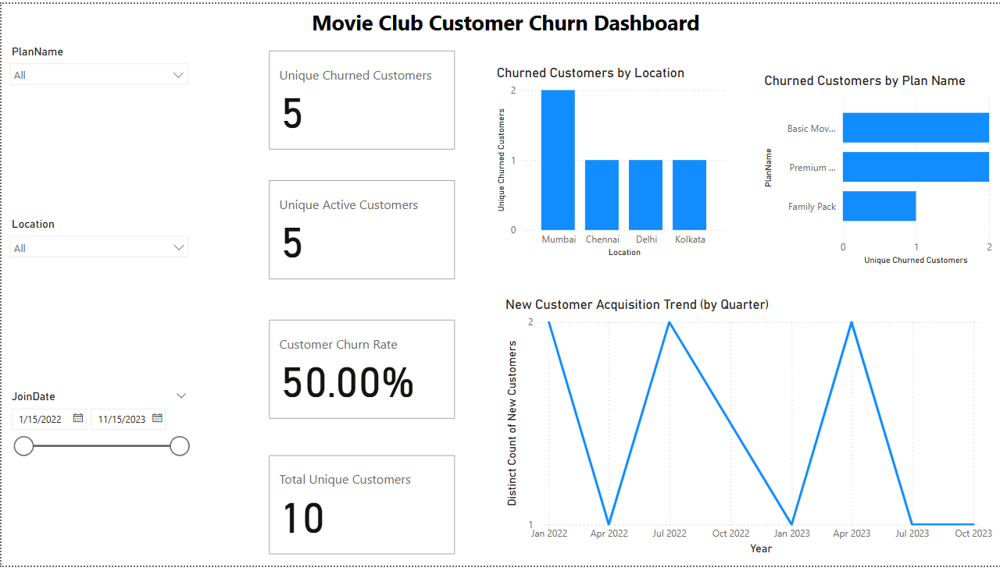

# Customer-Churn_Analysis
Analyzes customer churn using SQL for data preparation and Power BI for visualization
# Customer Churn Analysis (SQL + Power BI)
## Dashboard Preview

## Project Overview

This project demonstrates an end-to-end process for analyzing customer churn for a fictional subscription-based service. It involves setting up a SQL database, populating it with sample data, creating a view for analysis, and building an interactive dashboard in Power BI to visualize key churn metrics and patterns.

## Features

*   **SQL Backend:**
    *   Database schema with tables for `Customers`, `Plans`, and `Subscriptions`.
    *   Sample data reflecting subscription history, including active, cancelled, and expired statuses.
    *   A SQL View (`CustomerCurrentStatus`) that calculates the latest status for each customer, simplifying analysis.
*   **Power BI Dashboard:**
    *   Calculation of Key Performance Indicators (KPIs) using DAX measures:
        *   Total Unique Customers
        *   Unique Active Customers
        *   Unique Churned Customers
        *   Customer Churn Rate %
    *   Visualizations showing:
        *   Churned customer counts broken down by Subscription Plan.
        *   Churned customer counts broken down by Customer Location.
        *   Trend of new customer acquisition over time.
    *   Interactive Slicers to filter the report by Plan Name, Location, and Customer Join Date.

## Technologies Used

*   **Database:** Microsoft SQL Server (using T-SQL)
*   **ETL/Data Preparation:** SQL Server Management Studio (SSMS), SQL View
*   **Data Visualization:** Microsoft Power BI Desktop (using DAX for measures)
*   **Version Control:** Git / GitHub

## Setup and Usage

### 1. SQL Database Setup

*   **Prerequisites:** Microsoft SQL Server and SQL Server Management Studio (SSMS) installed.
*   **Execution:** Execute the provided `.sql` scripts in the following order using SSMS connected to your SQL Server instance:
    1.  `1_create_tables.sql`: Creates the necessary table structures within a database named `MovieClubChurnDB` (the script assumes this DB exists or you create it first).
    2.  `2_insert_data.sql`: Populates the tables with sample data. Includes verification SELECT statements at the end.
    3.  `3_create_view.sql`: Creates the `CustomerCurrentStatus` view used for analysis. Includes a test SELECT statement at the end.
    *(Ensure each script runs successfully before proceeding to the next)*

### 2. Power BI Report

*   **Prerequisites:** Microsoft Power BI Desktop (latest version recommended, free download).
*   **Download:** Download the `.pbix` report file (`Movie Club Churn Report.pbix` or your filename) from this repository.
*   **Open:** Open the downloaded `.pbix` file using Power BI Desktop.
*   **Configure Data Source:**
    *   Upon opening, Power BI may prompt you about the data source connection or show errors because it's trying to connect to the original SQL Server source.
    *   You need to point it to *your* SQL Server instance where you ran the setup scripts.
    *   Go to `File` -> `Options and settings` -> `Data source settings`.
    *   Select the listed SQL Server connection related to this report.
    *   Click `Change Source...`.
    *   In the 'Server' field, enter **your** SQL Server instance name (e.g., `localhost`, `.\SQLEXPRESS`).
    *   Ensure the 'Database' field correctly shows `MovieClubChurnDB`.
    *   Click `OK`.
    *   You may need to click `Edit Permissions...` and provide credentials (e.g., Windows credentials) for Power BI to access your SQL Server.
    *   Click `Close` on the Data source settings window.
    *   On the `Home` ribbon in Power BI, click **`Refresh`**. This will load the data from your local database setup into the report model.
*   **Interact:** Use the slicers and explore the dashboard visuals.

## Notes

*   The data included is synthetic sample data created solely for this demonstration project.
*   The Power BI report file (`.pbix`) contains the data model, DAX measures, and visuals, but the raw data connection needs to be refreshed against your local SQL Server setup as described above.
*   The `.pbix` file cannot be viewed directly on GitHub.
